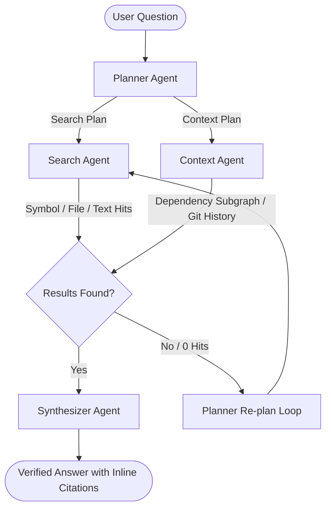

# 🔍 RepoLens

<div align="center">

### **Local-First AI Repository Intelligence & Architectural Comprehension Platform**

[](https://fastapi.tiangolo.com)
[](https://nextjs.org)
[](https://langchain-ai.github.io/langgraph/)
[](https://ollama.com)
[](https://tree-sitter.github.io/tree-sitter/)
[]()

<p align="center">
  <b>RepoLens</b> transforms complex, unfamiliar codebases into an interactive structural map and answers architectural questions with verifiable ground-truth evidence — <b>100% locally, with zero telemetry and zero code leaving your machine.</b>
</p>

</div>

---

## 🌟 Key Capabilities

### 🧠 1. Grounded Multi-Agent Intelligence (LangGraph + Ollama)
- **Zero Hallucination Guarantee**: Answers are synthesized strictly from AST-parsed code snippets, dependency subgraphs, and verified search hits.
- **Dynamic Re-planning**: Multi-agent state machine (Planner → Search / Context → Re-plan → Synthesizer) dynamically falls back and recovers from sparse queries.
- **Real-Time Agent Tracing**: Visual step indicators, token metrics, tool arguments, and executed query logs directly in the UI.

### 🕸️ 2. Interactive Subsystem Architecture Graph
- **Radial Cluster Force Layout**: Files are automatically clustered into logical subsystems with soft gravitational boundaries.
- **Visual Edge Weights**: Dependency strength and interaction frequencies are displayed via dynamic stroke widths (`1px`–`4.5px`) and color intensity.
- **Minimap HUD & Search Auto-Focus**: Live radar minimap in the bottom-right corner; search any file or module and press `Enter` to smoothly fly the camera and highlight the node with an illuminated pulsing beacon ring.
- **1-Click Diagram Exports**:
  - **Mermaid.js Markdown**: Instant copy of formatted Mermaid subgraph diagrams for Notion, Jira, and GitHub documentation.
  - **Vector SVG**: Instant download of high-resolution vector diagrams for technical reports and presentations.

### 🩺 3. Automated Codebase Health & Tech Debt Scorecard
- **Architectural Health Grade**: E.g. `86/100 — Grade A` computed via NetworkX topological analytics.
- **Circular Dependency Detection**: Identifies circular import loops (`nx.simple_cycles(G)`) and flags breaking risks.
- **Coupling Hotspot Radar**: Pinpoints high in-degree files (e.g. `lib/auth.js` with 9 dependents) and calculates blast radius.
- **Dead / Orphaned File Isolation**: Identifies unlinked, unreferenced source files.
- **Subsystem Modularity Ratio**: Measures intra-subsystem cohesion vs. cross-module coupling.
- **Actionable Refactoring Recommendations**: Generates concrete refactoring suggestions based on code graph topology.

### 📂 4. VS Code-Style Hierarchical Code Inspector
- **Integrated File Explorer**: Collapsible directory tree on the left sidebar with instant live search filter.
- **Deep Inspection**: Switch between files without leaving the modal, with syntax-highlighted source code, AST-extracted symbols, and per-file Git commit history.

### ⚡ 5. 9-Stage Multi-Language AST Indexing Pipeline
- **Tree-sitter AST Parsing**: Ingests **Python, TypeScript, and JavaScript** (`.py`, `.ts`, `.tsx`, `.js`, `.jsx`), extracting classes, functions, methods, interfaces, and docstrings.
- **Path Alias Resolution**: Automatically resolves TypeScript/Next.js `@/` and `~/` module paths.
- **Ripgrep Reference Index**: Builds symbol-to-usage reference graphs in sub-second speeds.
- **Git History & Contributor Analytics**: Aggregates author commit frequencies, file touch histories, and recent commit logs.

---

## 🏗️ Multi-Agent Architecture



---

## 🚀 Quick Start

### 1. Prerequisites
- **Python 3.10+** (Python 3.12 recommended)
- **Node.js 18+** & `npm`
- **Ollama** installed locally ([ollama.com](https://ollama.com))
- **ripgrep** installed and available on `PATH`

Pull the recommended local model:
```bash
ollama pull qwen2.5-coder:1.5b
```

---

### 2. Backend Setup

```bash
# Clone repository
git clone https://github.com/Atharvdel/RepoLens.git
cd RepoLens/backend

# Create virtual environment
python -m venv .venv
# On Windows:
.venv\Scripts\activate
# On macOS/Linux:
source .venv/bin/activate

# Install dependencies
pip install -r requirements.txt

# Start backend server (Port 8000)
uvicorn app.main:app --reload --port 8000
```
Backend API will be live at: **`http://localhost:8000`**  
Interactive OpenAPI Docs: **`http://localhost:8000/docs`**

---

### 3. Frontend Setup

```bash
cd ../frontend

# Install dependencies
npm install

# Start Next.js dev server (Port 3000)
npm run dev
```
Frontend UI will be live at: **`http://localhost:3000`**

---

### 4. Running with Docker (Optional PostgreSQL)

```bash
# Start PostgreSQL container from project root
docker compose up -d
```

---

## 🧪 Running Tests

RepoLens includes a comprehensive 163-test test suite covering AST parsing, graph algorithms, multi-agent dispatchers, and API routes:

```bash
cd backend
pytest -v
```

---

## 📂 Project Structure

```
RepoLens/
├── backend/
│   ├── app/
│   │   ├── agents/          # LangGraph multi-agent pipeline (Planner, Search, Context, Synthesizer)
│   │   ├── api/             # FastAPI REST endpoints (repositories, chat, graph, health, files)
│   │   ├── indexing/        # 9-stage pipeline (Tree-sitter AST, import graph, ripgrep, git history)
│   │   ├── tools/           # Deterministic tools (architecture, dependency graph, file history, text search)
│   │   ├── models/          # SQLAlchemy database models & Alembic migrations
│   │   ├── db.py            # Database session manager
│   │   └── main.py          # FastAPI application entrypoint
│   ├── tests/               # 163 unit and integration tests
│   └── requirements.txt     # Backend Python dependencies
├── frontend/
│   ├── app/                 # Next.js 14 App Router pages
│   │   ├── repo/[id]/       # Repository dashboard & Health Scorecard
│   │   └── repo/[id]/chat/  # Interactive Graph Canvas & Multi-Agent Chat
│   ├── components/          # React components (GraphCanvas, HealthScorecard, CodeViewerModal, Minimap HUD)
│   ├── lib/                 # API client bindings and TypeScript interfaces
│   └── package.json         # Frontend dependencies
├── docs/
│   └── RepoLens_SDD.md      # Full Software Design Document (Architecture, Schema, Graph Math)
├── docker-compose.yml       # Docker deployment configuration
└── README.md
```

---

## 📄 Documentation

For full architectural specifications, schema definitions, and algorithmic tradeoffs, see the **[Software Design Document (SDD)](./docs/RepoLens_SDD.md)**.

---

## 🛡️ License

This project is licensed under the **MIT License**.
